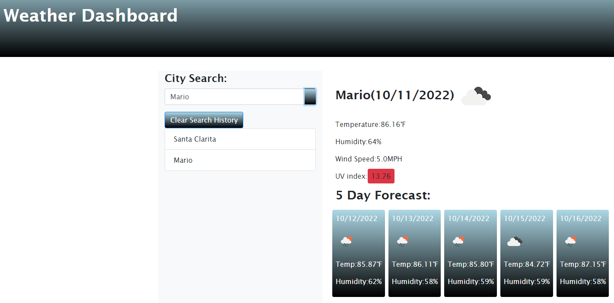

# Weather Dashboard

## Description

A website that allows users to search for cities and learn their current weather conditions, as well as a 5 day forecast.

## Installation

First, navigate to the site: https://darxmarx.github.io/weather-dashboard/
 
Then, search for a city as desired.

## Usage

This website exists as a simple and intuitive method of quickly looking up the weather conditions of a given city. By utilizing the OpenWeather 5 day weather forecast API, the site grabs whatever city the user types into the search bar, and then applies that search term to its own database, returning the city's most recently updated temperature, in Fahrenheit, humidity, wind speed, and UV index. Additionally, a 5 day forecast displays the temperature and humidity of the next five days for that city. Local storage is utilized to track the user's search queries, allowing easy access for double-checking the same cities as desired.

## Screenshot

## Credits

OpenWeather, the owner of the publicly available API: https://openweathermap.org/

## License

Please refer to the LICENSE in the repo.